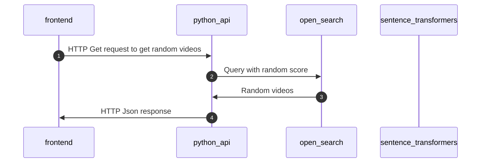
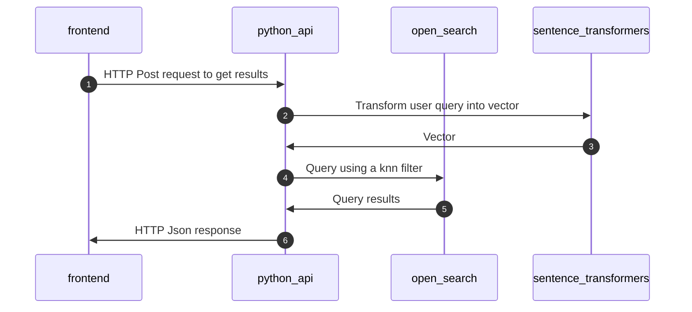

# Search engine

**Note:** You cand find more information on `data/`, `back-end` and `front-end` folders.

## Resume

### On load

```mermaid
sequenceDiagram
  autonumber
  participant frontend
  participant python_api
  participant open_search
  participant sentence_transformers
  
  frontend ->> python_api: HTTP Get request to get random videos
  python_api ->> open_search: Query with random score
  open_search ->> python_api: Random videos
  python_api ->> frontend: HTTP Json response
```

### On user submit

```mermaid
sequenceDiagram
  autonumber
  participant frontend
  participant python_api
  participant open_search
  participant sentence_transformers
  
  frontend ->> python_api: HTTP Post request to get results
  python_api ->> sentence_transformers: Transform user query into vector
  sentence_transformers ->> python_api: Vector
  python_api ->> open_search: Query using a knn filter
  open_search ->> python_api: Query results
  python_api ->> frontend: HTTP Json response
```
